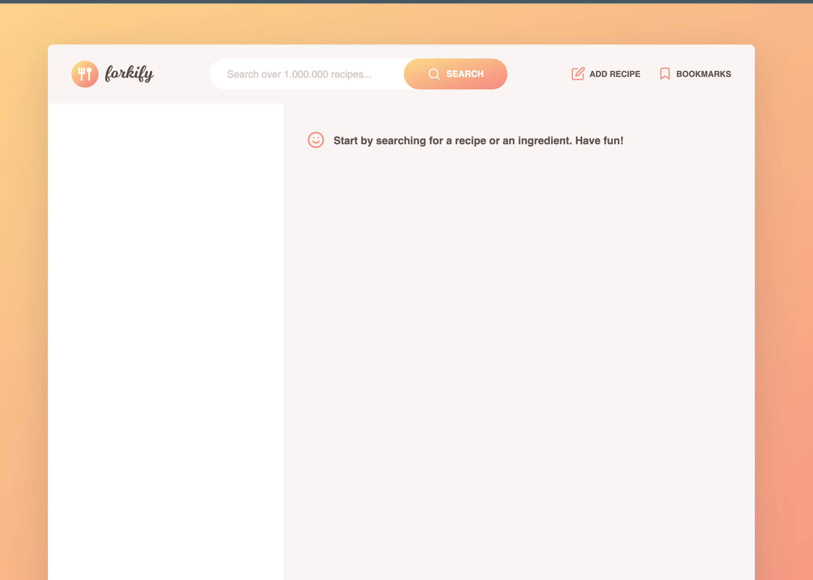
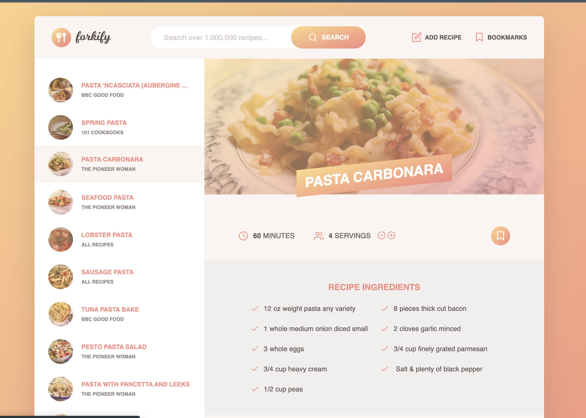

# Java Script - Recipe Finder

## Welcome! 👋

### This is a very complex program, created in the process of studying Java Script at the Udemy course. This program is from there, from the course, **not mine**.

#

### Live link to this programm:

### [https://recipe-finder-semandr.netlify.app/](https://recipe-finder-semandr.netlify.app/)

#

### The program is multi-module, during the development used:

- Native Java Script, last versions and features
- Multi-module JS structure
- HTML5
- SCSS
- Parcel
- Git

#

## Some pveview files

#

## Principal functionality:

- It is possible to search and create new recipes, change the number of people for any dishes (the number of ingredients is recalculated automatically).
- You can create bookmarks that use the browser's local storage.
- You can also add and upload your new recipes.

#

## P.S.

### This program is very complex and in my personal opinion (for me personally) it is not designed for beginners who want to learn Java Script from scratch. At the moment, at this time, I will not be able to create such really complex program by myself. But during learning many techniques in the process of writing this program from the Udemy training course, I have learned a lot and I hope to apply this knowledge in the future, with more practical experience.
